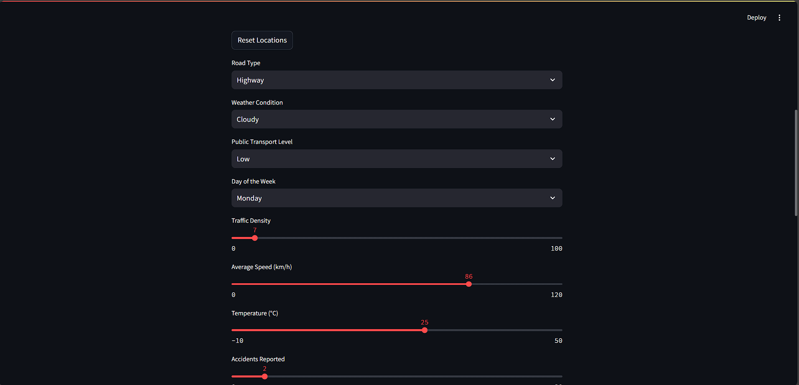
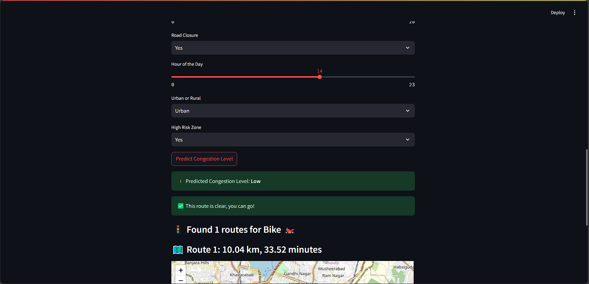
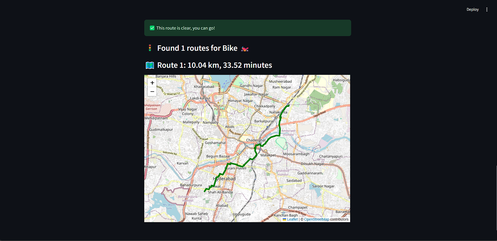

# 🚗🏍️ Alternative Route Finder

This is a **Streamlit-based web app** that helps users find alternative routes for travel using **OpenRouteService API** and an interactive **Folium map**.

## ✨ Features

- Select start and destination locations by clicking on the map.
- Choose travel mode: **Car 🚗** or **Bike 🏍️**.
- Fetch route details including **distance** and **estimated time**.
- Display routes dynamically on an interactive **Folium map**.

## 🛠️ Technologies Used

- **Python** (Backend)
- **Streamlit** (Web App Framework)
- **OpenRouteService API** (Routing)
- **Folium** (Interactive Maps)

## 🚀 Installation

1. Clone the repository:
   ```sh
   git clone https://github.com/sumanthgubbala/Traffic_prediction_and_ManagemnetSystem.git
   ```

## 🛠️ Install dependencies:

1. Run the command :

   ```sh
   pip install -r requirements.txt

   ```

2. Run the app:
   ```sh
   streamlit run traffic_app.py
   ```

## 🔑 API Key Setup

    Replace API_KEY in traffic_app.py with your OpenRouteService API key.

## 📸 Screenshot

    [alt text](image-1.png)

    

    

    
